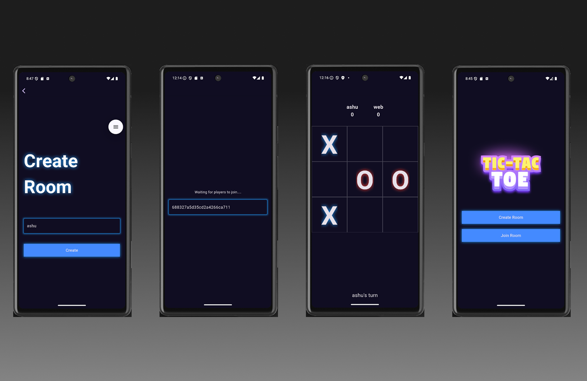

# 🔷 Multiplayer Tic Tac Toe Game

A real-time multiplayer Tic Tac Toe game built with:

- 🧠 **Flutter** (Frontend)
- ⚡ **Node.js + Socket.IO** (Backend)
- 🗃️ **MongoDB Atlas** (Database)

---

## 🖼️ Screenshot

---

## 📦 Features

- Two-player real-time game with sockets
- Automatic room creation & joining
- Turn-based gameplay with visual UI
- Score tracking and max rounds limit
- Winner declaration and "Play Again" option
- Automatic board reset for next round
- Handles disconnection gracefully

---

### 🔧 Prerequisites

- [Node.js](https://nodejs.org/) (v14+)
- [Flutter SDK](https://flutter.dev/docs/get-started/install)
- [MongoDB Atlas](https://www.mongodb.com/cloud/atlas)

---

