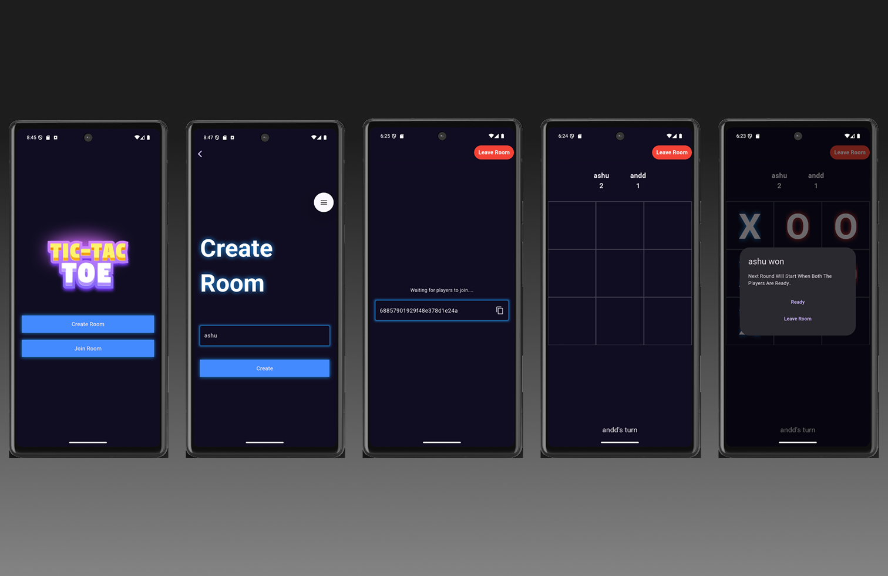

# 🔷 Multiplayer Tic Tac Toe Game

A real-time multiplayer Tic Tac Toe game built with:

- 🧠 **Flutter** (Frontend)
- ⚡ **Node.js + Socket.IO** (Backend)
- 🗃️ **MongoDB Atlas** (Database)

---

## 🖼️ Screenshot

---

## 📦 Features

- Two-player real-time game with sockets
- Automatic room creation & joining
- Turn-based gameplay with visual UI
- Score tracking and max rounds limit
- Winner declaration and "Play Again" option
- Automatic board reset for next round
- Handles disconnection gracefully

---

## 🎮 How to Play

1. **Main Menu:** Choose to create a new room or join an existing one.
2. **Create Room:** Enter your nickname to start a new game. Share the generated room ID with your friend.
3. **Join Room:** Enter your nickname and the room ID to join your friend's game.
4. **Gameplay:** Take turns tapping the grid. The winner is declared after the set number of rounds, with scores tracked.
5. **Play Again:** Option to reset and play more rounds!

---

### 🔧 Prerequisites

- [Node.js](https://nodejs.org/) (v14+)
- [Flutter SDK](https://flutter.dev/docs/get-started/install)
- [MongoDB Atlas](https://www.mongodb.com/cloud/atlas)

---

